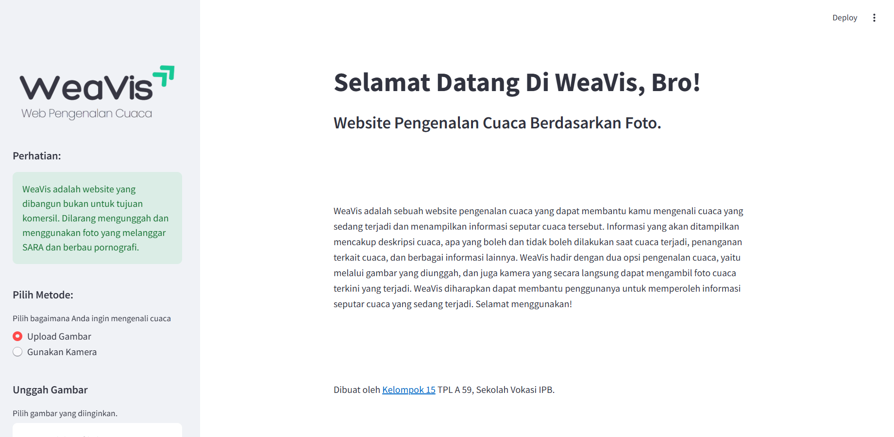

<div align= "center">
</div>

<div align="center">

<h2>⛅ WeaVis: Weather Recognition</h2>

<br>



</div>

## 💡 Overview

WeaVis is a simple website that can recognize weather uploaded by users or through live camera photos. WeaVis will also provide descriptions and information about the weather uploaded by users. WeaVis is built using a CNN model with MobileNet architecture, and Streamlit as a support library to build the website display.

## ⛓️‍💥 Project Link

[Click here](https://weavis.streamlit.app) to take you to the WeaVis project website.

## ✨ Features

- 📤 Weather recognition by uploading images.
- 📸 Weather recognition with real-time camera.
- 📢 Information on what to do and what not to do during the weather.
- 📄 Explanation of the current weather.

## 👩‍💻 Tech Stack

- **Python**:  A versatile programming language used for web development, machine learning, and more.
- **PyTorch**: An open-source machine learning library based on Torch.
- **Streamlit**: A Python library for creating interactive web apps for data science and machine learning.
- **GitHub**: A platform for help host and managing code projects.
- **ResNet50, AlexNet, MobileNet v3 Large, VGG16**: CNN architectures commonly used in computer vision tasks.
- **Adam Optimizer**: An optimization algorithm used in training neural networks.
  
## 📖 Dataset

[Click here](https://drive.google.com/drive/folders/1FUQS6PoDmd0uHLU0gUPyAM5lNV8ODXzp?usp=sharing) to access the dataset.

<br>

Credits to the original dataset owner:
- Xiao, H. (2021). Weather phenomenon database (WEAPD). Harvard Dataverse. [DOI](https://doi.org/10.7910/DVN/M8JQCR)
- Ajayi, G. (2018). Multi-class Weather Dataset for Image Classification. Mendeley Data, V1. [DOI](http://dx.doi.org/10.17632/4drtyfjtfy.1)

## 📉 Model Accuracy and Loss Graph

- **CNN Based Model**


- **ResNet50 Model**


- **AlexNet Model**


- **MobileNet v3 Large Model**


- **VGG16 Model**


## 🛠️ Installation

1. **Clone the repository:**

   ```bash
   git clone https://github.com/sumonta056/readme-template.git
   cd readme-template
   ```

2. **Install dependencies:**

   Using Npm:

   ```bash
   npm install
   ```

3. **Set up environment variables:**

   Create a `.env` file in the root directory and add the following variables:

   ```env
   NEXT_PUBLIC_APP_URL=http://localhost:3000

   #database
   DATABASE_URL=your_database_url
   DATABASE_SECRET=your_database_secret
   DRIZZLE_DATABASE_URL=your_database_url_for_drizzle

   #auth
   AUTH_SECRET=any_random_secret
   ```

4. **Run database migrations:**

   Ensure your database is running and then run:

   ```bash
   npm run drizzle-kit migrate
   ```

5. **Start the development server:**

   ```bash
   npm run dev
   ```

## 📖 Usage

### ✔ Running the Website

- **Development mode:** `npm run dev`, `yarn dev`, or `bun dev`.
- **Production mode:** `npm run build && npm start`, `yarn build && yarn start`, or `bun run build && bun start`.

> Open [http://localhost:3000](http://localhost:3000) to view the app in your browser.

### 📃 API Documentation

The API documentation for this application is available at [http://localhost:3000/api/docs](http://localhost:3000/api/docs). It details all endpoints and their usage.

## 🤝 Contributing

We welcome contributions to this project. Please follow these steps to contribute:

1. **Fork the repository.**
2. **Create a new branch** (`git checkout -b feature/your-feature-name`).
3. **Make your changes** and commit them (`git commit -m 'Add some feature'`).
4. **Push to the branch** (`git push origin feature/your-feature-name`).
5. **Open a pull request**.

Please make sure to update tests as appropriate.

## 🐛 Issues

If you encounter any issues while using or setting up the project, please check the [Issues]() section to see if it has already been reported. If not, feel free to open a new issue detailing the problem.

When reporting an issue, please include:

- A clear and descriptive title.
- A detailed description of the problem.
- Steps to reproduce the issue.
- Any relevant logs or screenshots.
- The environment in which the issue occurs (OS, browser, Node.js version, etc.).

## 📜 License

Distributed under the MIT License. See [License](/LICENSE) for more information.
