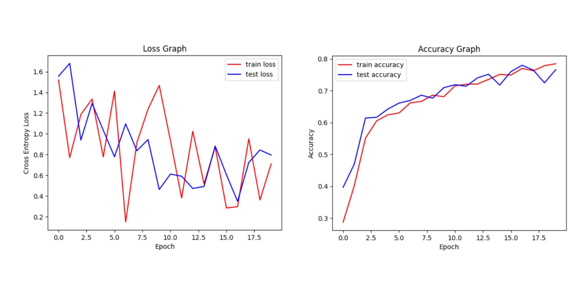
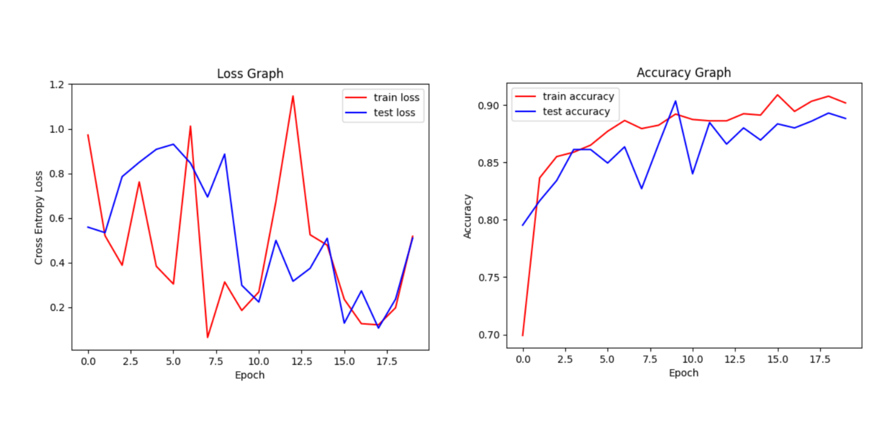
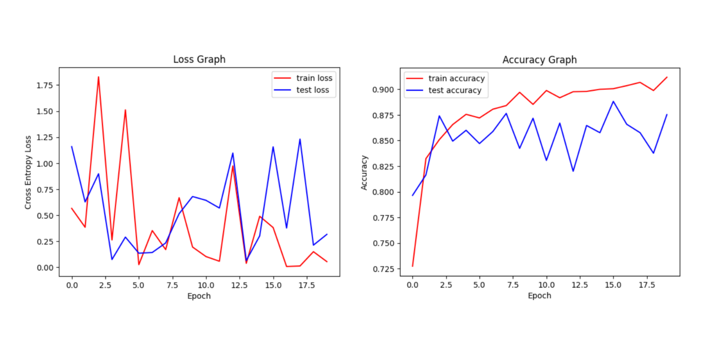
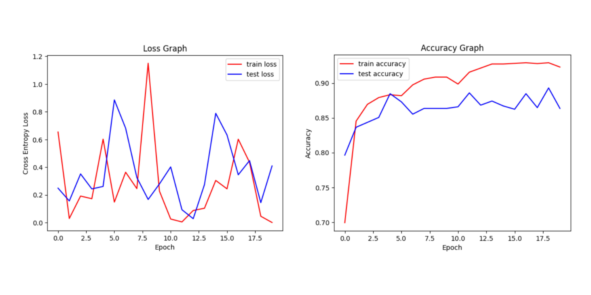

<h2>⛅ WeaVis: Weather Recognition</h2>

 

## Overview

WeaVis is an AI-based weather recognition information system designed to recognize weather uploaded or photographed by users, and then display information about the weather. Built on PyTorch, with CNN algorithm plus MobileNet v3 architecture, the weather predictions provided have very good accuracy values.

## Project Link

[Click here](https://weavis.streamlit.app) to take you to the WeaVis project website.

## Features

- Weather recognition by uploading images.
- Weather recognition with real-time camera.
- Information on what to do and what not to do during the weather.
- Explanation of the current weather.

## Tech Stack

- **Python**:  A versatile programming language used for web development, machine learning, and more.
- **PyTorch**: An open-source machine learning library based on Torch.
- **Streamlit**: A Python library for creating interactive web apps for data science and machine learning.
- **GitHub**: A platform for help host and managing code projects.
- **ResNet50, AlexNet, MobileNet v3 Large, VGG16**: CNN architectures commonly used in computer vision tasks.
- **Adam Optimizer**: An optimization algorithm used in training neural networks.
  
## Dataset

[Click here](https://drive.google.com/drive/folders/1FUQS6PoDmd0uHLU0gUPyAM5lNV8ODXzp?usp=sharing) to access the dataset.

 

Credits to the original dataset owner:
- Xiao, H. (2021). Weather phenomenon database (WEAPD). Harvard Dataverse. [DOI](https://doi.org/10.7910/DVN/M8JQCR)
- Ajayi, G. (2018). Multi-class Weather Dataset for Image Classification. Mendeley Data, V1. [DOI](http://dx.doi.org/10.17632/4drtyfjtfy.1)

## How to Use This Code?

We welcome contributions to this project. Please follow these steps to contribute:

1. **Clone this repository to your computer** (`git clone https://github.com/Rfldmr/weavis-weather-recognition-using-cnn.git`)
2. **Read the requirements.txt file in the repository, make sure you have installed everything needed according to the version listed.**
3. **Open the file named app.py which is in the repository.**
4. **Install the Streamlit framework with the following command** (`pip install streamlit`).
5. **Run the following command to run the program on localhost** (`python -m streamlit run app.py`).

## Model Accuracy and Loss Graph

- **CNN Based Model**

Akurasi Training Tertinggi: 0.79 | Akurasi Testing Tertinggi: 0.77

- **ResNet50 Model**

Akurasi Training Tertinggi: 0.90 | Akurasi Testing Tertinggi: 0.90

- **AlexNet Model**

Akurasi Training Tertinggi: 0.91 | Akurasi Testing Tertinggi: 0.88

- **MobileNet v3 Large Model**

Akurasi Training Tertinggi: 0.93 | Akurasi Testing Tertinggi: 0.91

- **VGG16 Model**

Akurasi Training Tertinggi: 0.93 | Akurasi Testing Tertinggi: 0.89

## Copyright

© 2025 Rafli Damara.
